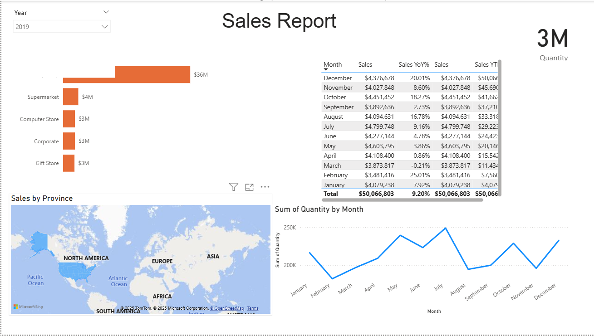

# Power BI Beginner Project

This repository contains a beginner-level Power BI project created by following Leila Gharani

## 📌 Project Overview

The goal of this project is to demonstrate:
- Importing data from CSV and Excel
- Data transformation using Power Query
- Creating relationships between tables
- Building interactive visuals and dashboards
- Publishing and sharing Power BI reports

## 📊 Features Implemented

- Data cleaning and transformation in Power Query
- Table relationships for data modeling
- Interactive visuals:
  - Bar and line charts
  - KPI visual
  - Map chart
  - Slicers for filtering
- Dashboard-style report layout

## 🛠 Tools Used

- Microsoft Power BI Desktop
- Power Query Editor
- Excel 

## 📚 Learning Source

Tutorial by **Leila Gharani**  

## 📷 Dashboard Preview
## 📊 Sales Report Dashboard

